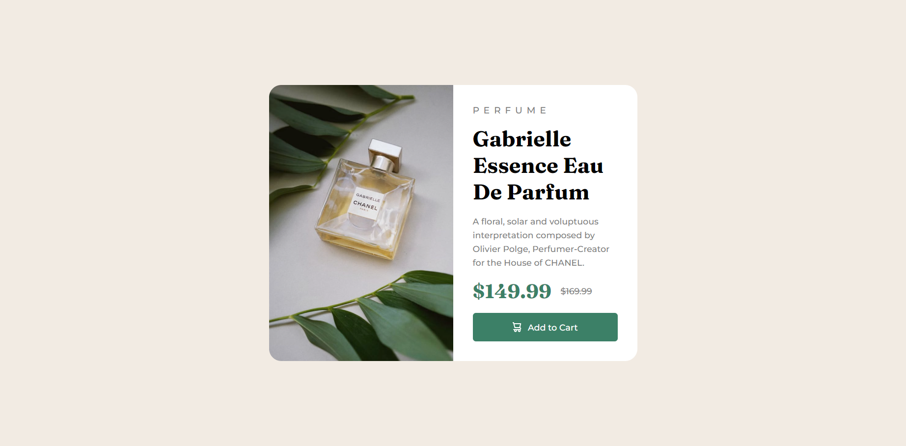
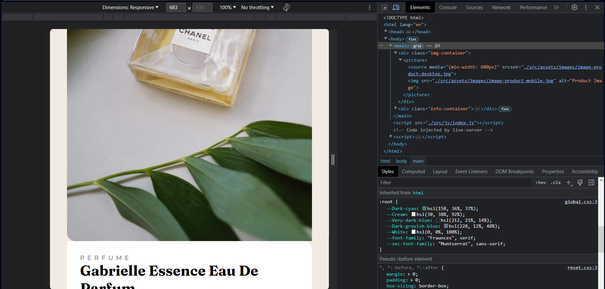

# Frontend Mentor - Product preview card component solution

This is a solution to the [Product preview card component challenge on Frontend Mentor](https://www.frontendmentor.io/challenges/product-preview-card-component-GO7UmttRfa). Frontend Mentor challenges help you improve your coding skills by building realistic projects.

## Table of contents

- [Overview](#overview)
  - [Screenshot](#screenshot)
  - [Links](#links)
- [My process](#my-process)
  - [Built with](#built-with)
  - [What I learned](#what-i-learned)
  - [Continued development](#continued-development)
- [Author](#author)

## Overview

### Screenshot




### Links

- Solution URL: [Solution](https://www.frontendmentor.io/solutions/qr-code-component-using-html-css-9kojabnwDp)
- Live Site URL: [Live Site](https://product-preview-component-fxanz.vercel.app)

## My process



### Built with

- Semantic HTML5 markup
- CSS custom properties
- Flexbox
- Grid

### What I learned

i learn how to use picture and source for responsive img

```html
<picture>
  <source media="(min-width: 600px)" srcset="./src/assets/images/image-product-desktop.jpg" />
  
</picture>
```

i learn how to use first child and last child in css
```css
.info-container ul li:first-child {
}
.info-container ul li:last-child {
}
```

### Continued development

I'll focus to 'best practice' my code in the future, probably will start using sass in the future

## Author

- Frontend Mentor - [@Fxanz](https://www.frontendmentor.io/profile/Fxanz)
- Twitter - [@IFxanz](https://www.twitter.com/IFxanz)
