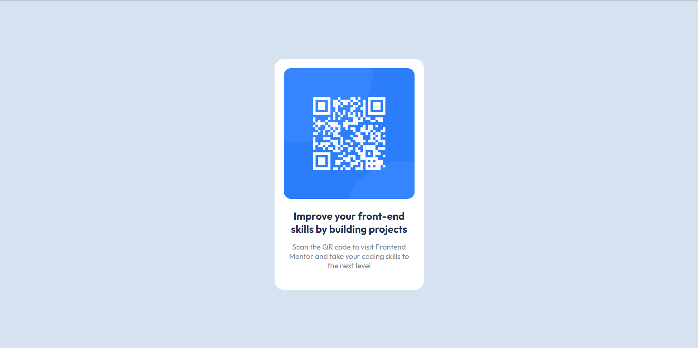
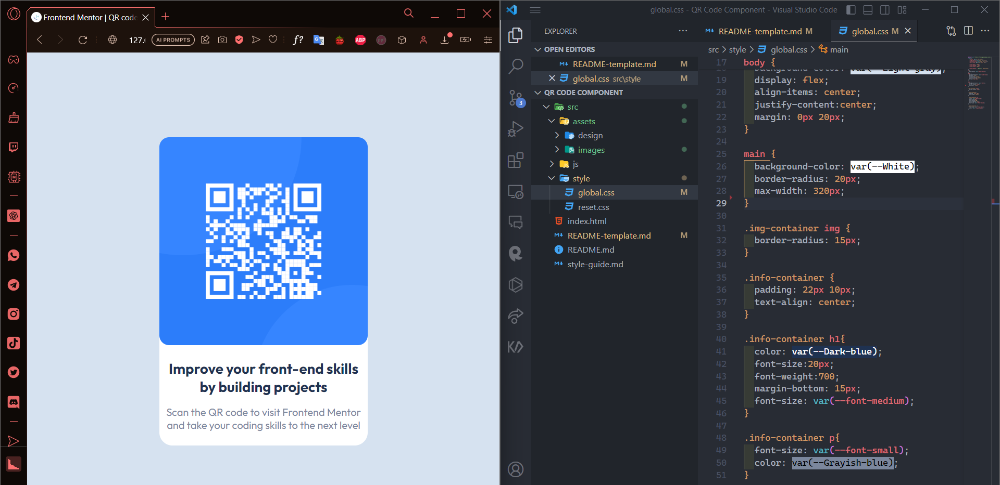

# Frontend Mentor - QR code component solution

This is a solution to the [QR code component challenge on Frontend Mentor](https://www.frontendmentor.io/challenges/qr-code-component-iux_sIO_H). Frontend Mentor challenges help you improve your coding skills by building realistic projects.

## Table of contents

- [Overview](#overview)
  - [Screenshot](#screenshot)
  - [Links](#links)
- [My process](#my-process)
  - [Built with](#built-with)
  - [What I learned](#what-i-learned)
  - [Continued development](#continued-development)
  - [Useful resources](#useful-resources)
- [Author](#author)

## Overview

### Screenshot



### Links

- Solution URL: [Solution](https://www.frontendmentor.io/solutions/qr-code-component-using-html-css-9kojabnwDp)
- Live Site URL: [Live Site](https://qr-code-component-fxanz.vercel.app)

## My process



### Built with

- Semantic HTML5 markup
- CSS custom properties
- Flexbox
- Mobile-first workflow

### What I learned

find out how to use good root and how to use css reset across different files.

```html
<link rel="stylesheet" href="./src/style/reset.css" /> 
<link rel="stylesheet" href="./src/style/global.css" />
```

```css
*,
*::before,
*::after {
  margin: 0;
  padding: 0;
  box-sizing: border-box;
  font: inherit;
  list-style: none;
  text-decoration: none;
  outline: none;
}

body {
  min-height: 100vh;
}

img,
picture,
svg,
video {
  display: block;
  max-width: 100%;
}
```

```css
:root {
  --White: hsl(0, 0%, 100%);
  --Light-gray: hsl(212, 45%, 89%);
  --Grayish-blue: hsl(220, 15%, 55%);
  --Dark-blue: hsl(218, 44%, 22%);

  --font-small: 16px;
  --font-medium: 22px;
  --font-large: 30px;

  --font-family: "Outfit", sans-serif;
}
```

### Continued development

I'll focus to 'best practice' my code in the future, using root is more proficient and understands default css better, reset css etc

### Useful resources

- [Nathasha](https://uxplanet.org/challenge-009-qr-code-component-535916bbd967) - this article helped to organize my code better, with clear descriptions that made it clearer for me to understand where to go and what kind of div to create

## Author

- Frontend Mentor - [@Fxanz](https://www.frontendmentor.io/profile/Fxanz)
- Twitter - [@IFxanz](https://www.twitter.com/IFxanz)
