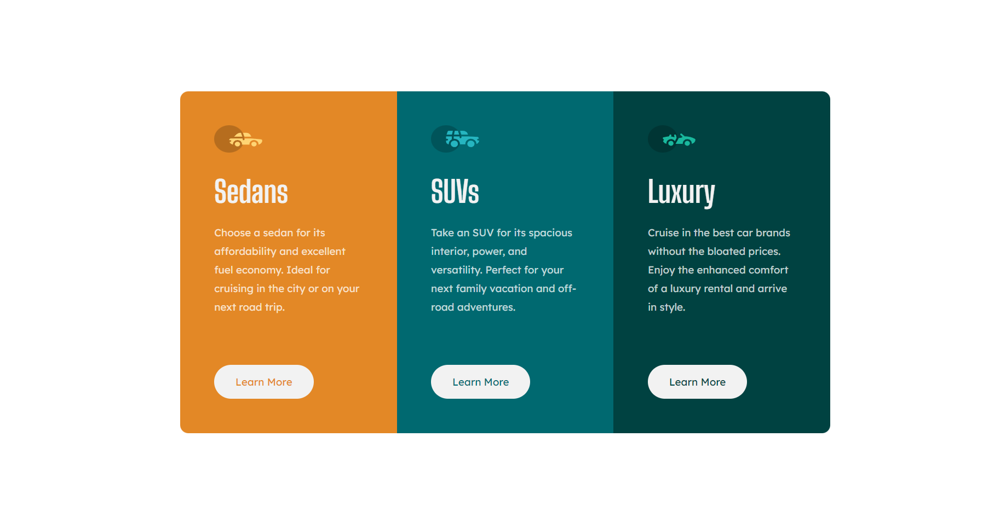
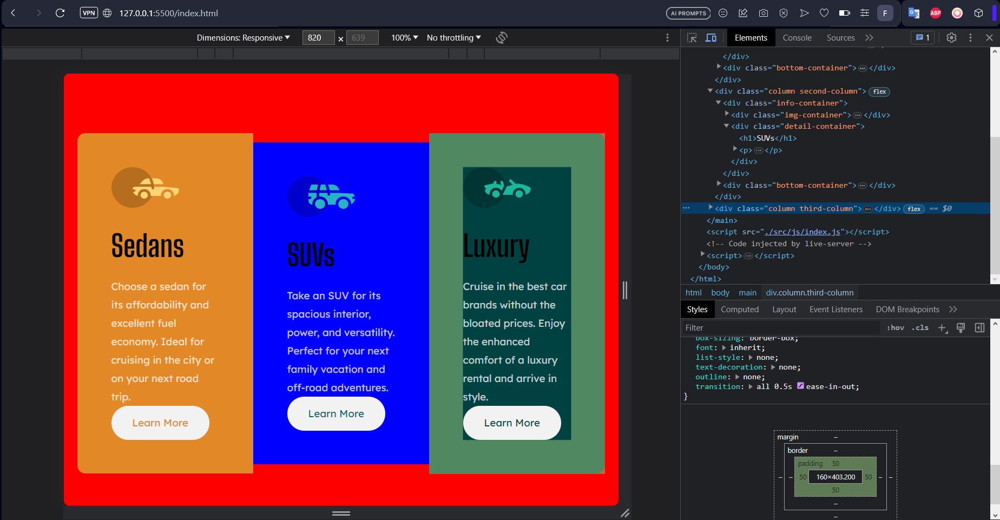

# Frontend Mentor - 3-column preview card component solution

This is a solution to the [3-column preview card component challenge on Frontend Mentor](https://www.frontendmentor.io/challenges/3column-preview-card-component-pH92eAR2-). Frontend Mentor challenges help you improve your coding skills by building realistic projects. 

## Table of contents

- [Overview](#overview)
  - [Screenshot](#screenshot)
  - [Links](#links)
- [My process](#my-process)
  - [Built with](#built-with)
  - [What I learned](#what-i-learned)
  - [Continued development](#continued-development)
  - [Useful resources](#useful-resources)
- [Author](#author)

## Overview

### Screenshot

### Links

- Solution URL: [Solution](https://www.frontendmentor.io/solutions/qr-code-component-using-html-css-9kojabnwDp)
- Live Site URL: [Live Site](https://all-frontendmentor.vercel.app/challenges/3%20Column%20Preview/index.html)

## My process

### Built with

- Semantic HTML5 markup
- CSS custom properties
- Flexbox
- Mobile-first workflow

### What I learned

### Continued development

I'll focus to 'best practice' my code in the future, using root is more proficient and understands default css better, reset css etc

### Useful resources

## Author

- Frontend Mentor - [@Fxanz](https://www.frontendmentor.io/profile/Fxanz)
- Twitter - [@IFxanz](https://www.twitter.com/IFxanz)
